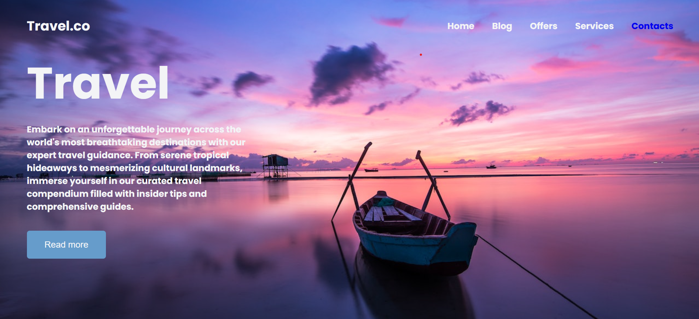
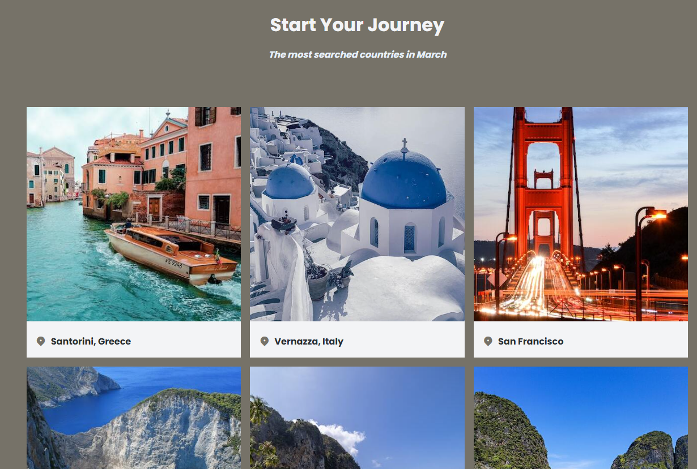
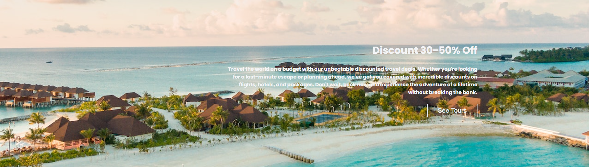
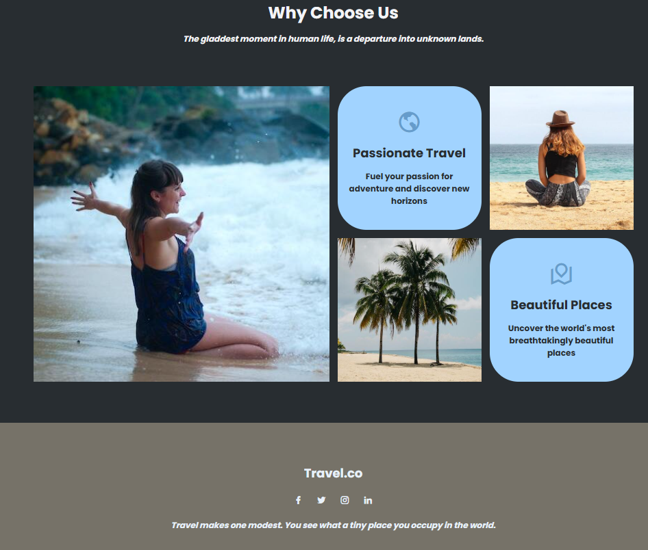

# ✈️ Travel.co — Blog Landing Page

A visually rich travel blog landing page built with HTML and CSS, featuring destination cards, an offers banner, and a services showcase.

---

## 📸 Screenshots

| | |
|:---:|:---:|
|  |  |
| *Home* | *Journey* |
|  |  |
| *Service* | *Why Choose Us* |

---

## 🚀 Features

- 🌍 Full-screen hero with background image and CTA button
- 📍 Destination cards grid (Santorini, Vernazza, San Francisco, Navagio, Ao Nang, Phi Phi Island)
- 🏷️ Offers/discount banner section
- 🗺️ "Why Choose Us" services grid with images and icons
- 🔗 Smooth scroll navigation with active link highlighting
- 📱 Fully responsive across all screen sizes

---

## 🛠️ Built With

| Technology | Usage |
|------------|-------|
| HTML5 | Structure & layout |
| CSS3 | Styling & responsiveness |
| JavaScript (Vanilla) | Smooth scroll & active link behavior |
| [Remix Icons](https://remixicon.com/) | Icons |
| [Google Fonts](https://fonts.google.com/) | Typography (Poppins) |

---

## 📂 Project Structure

```
blog-page/
├── index.html              # Main HTML file
├── assets/
│   ├── style.css           # Stylesheet
│   └── image/
│       ├── bg-1.jpg        # Hero background
│       ├── bg-2.jpg        # Offers banner background
│       ├── country-1.jpg   # Santorini, Greece
│       ├── country-2.jpg   # Vernazza, Italy
│       ├── country-3.jpg   # San Francisco
│       ├── country-4.jpg   # Navagio, Greece
│       ├── country-5.jpg   # Ao Nang, Thailand
│       ├── country-6.jpg   # Phi Phi Island, Thailand
│       ├── grid-1.jpg      # Services grid image
│       ├── grid-2.jpg      # Services grid image
│       └── grid-3.jpg      # Services grid image
└── screenshots/
    ├── home.png            # Hero section
    ├── journey.png         # Destinations section
    ├── service.png         # Services section
    └── whychooseus.png     # Why Choose Us section
```

---

## 📑 Sections

| Section | Description |
|---------|-------------|
| **Home** | Full-screen header with tagline and CTA button |
| **Blog** | 6 destination cards with location pins |
| **Offers** | Discount banner with background image |
| **Services** | "Why Choose Us" grid with images and feature cards |
| **Footer** | Brand info and social media links |

---

## ⚙️ Getting Started

1. **Clone the repository**
   ```bash
   git clone https://github.com/NainaKothari-14/blog-page.git
   ```

2. **Navigate into the project folder**
   ```bash
   cd blog-page
   ```

3. **Open `index.html` in your browser**  
   Just double-click — no server or installation needed!

---

## 👩‍💻 Author

**Naina Kothari**  
GitHub: [@NainaKothari-14](https://github.com/NainaKothari-14)
